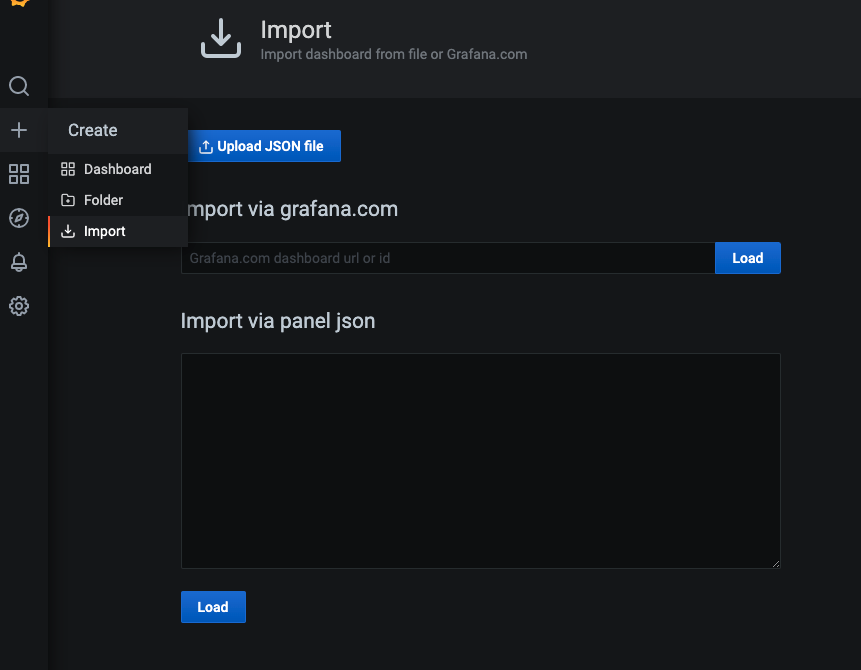
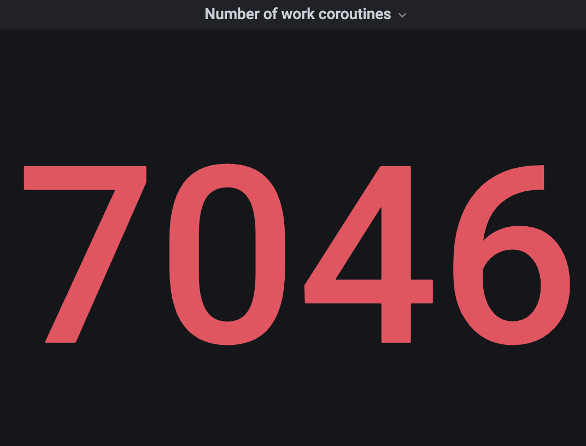
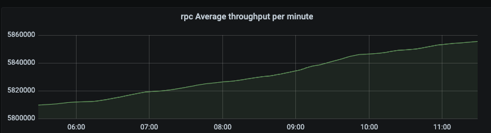
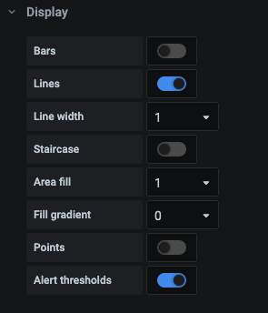
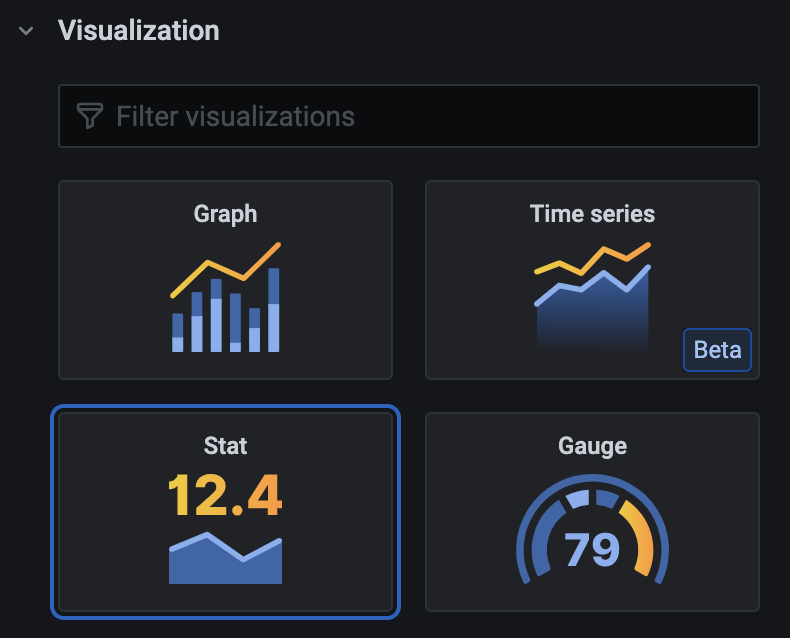
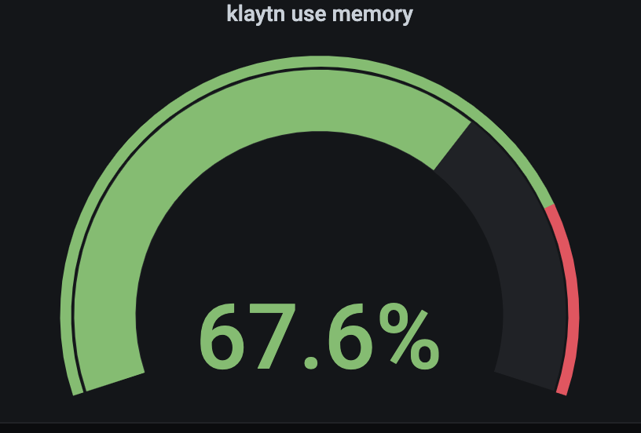
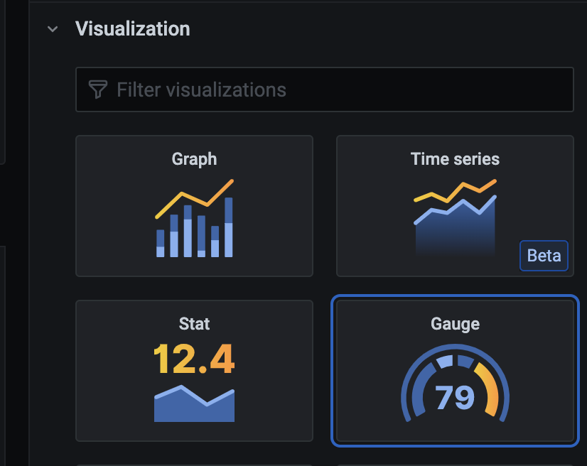
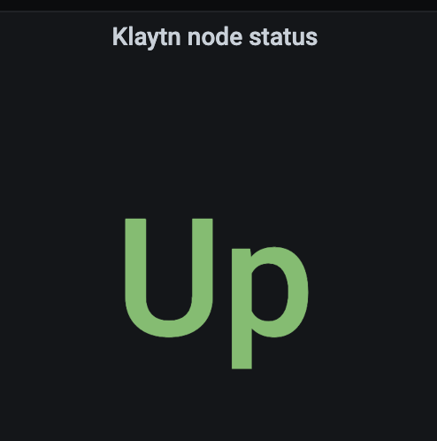
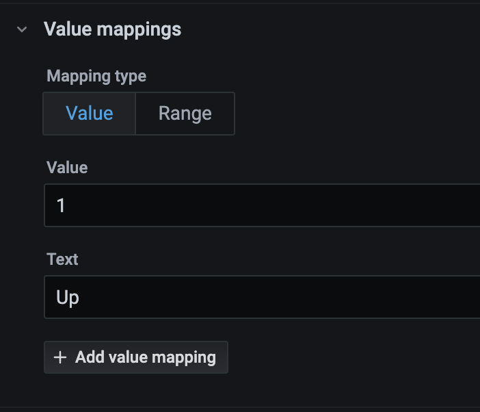

# Production level monitoring


This production-grade system architecture used [ghostunnel](https://github.com/ghostunnel/ghostunnel) to increase the system's security level. 

Also, setting on Grafana would be presented.

# Configure ghostunnel


## Set systemd

After you install ghostunnel on your machine, you can run that as a systemd. This will bind the original port to ghostunnel port.

You can bind your node to any available port. In this example, :8899 -> :1662 and :61001 -> :1663.

Then you will modify the service file as the following for Hyper node :

`gt-node-exporter.service`:
```
[Unit]
Description=Ghost Tunnel - HyperNode Exporter
After=network-online.target

[Service]
User=root
Restart=on-failure
ExecStart=/usr/local/ghostunnel/ghostunnel server --listen 0.0.0.0:1662 --target localhost:8899 --key /etc/ssl/private/ghostunnel-selfsigned.key --cert /etc/ssl/certs/ghostunnel-selfsigned.pem --disable-authentication

[Install]
WantedBy=multi-user.target
and the Klaytn node service file as the following:
```
For Klaytn port binding, `gt-node-exporter.service`
```
[Unit]
Description=Ghost Tunnel - Klaytn Node Exporter
After=network-online.target

[Service]
User=root
Restart=on-failure
ExecStart=/usr/local/ghostunnel/ghostunnel server --listen 0.0.0.0:1663 --target localhost:61001 --key /etc/ssl/private/ghostunnel-selfsigned.key --cert /etc/ssl/certs/ghostunnel-selfsigned.pem --disable-authentication

[Install]
WantedBy=multi-user.target
```

## Set ufw

If you enable and start the service, you will port forwarding 8899 to 1662 and expose it publicly to your prometheus server. mind to allow it on ufw using this cmd:

```
sudo ufw allow proto tcp from <NODE IP> to <Prometheus IP> port 1662 comment "Hypernode monitoring"
```

```
sudo ufw allow proto tcp from <NODE IP> to <Prometheus IP> port 1663 comment "Klaytn node monitoring" 
```

# Prometheus monitoring

Follow the [official tutorial](https://testnet-docs.blockpi.io/guide-for-operators/testnet-1/monitoring). Prometheus should listen to the ghosttunnel output instead of the original output:

:8899 -> :1662

:61001 -> :1663 


# Grafana board

## Import JSON file

You can import [json file](https://2808964508-files.gitbook.io/~/files/v0/b/gitbook-x-prod.appspot.com/o/spaces%2Fxax1tyVa6K2eFj1R2Tb8%2Fuploads%2Fwj7pOmjhqIXIBa4i7GpU%2FHyperNode.txt?alt=media&token=c4cfd5e2-f91a-4ea5-9c01-809ee4bc8dbf) from [official tutorial](https://testnet-docs.blockpi.io/guide-for-operators/testnet-1/monitoring). Import that from the import tab:



## Hypernode

### Number of work coroutines



Metrics:
```
go_goroutines{class="HyperNode", job="blockpi", instance="<Your instance name>"}
```

### RPC Average Thoughout



Metrics:
```
grpc_server_started_total{class="HyperNode", grpc_method="Relay",host="<Your instance>", job="blockpi", grpc_service="x.blockpi.RelayService", grpc_type="unary"}
```

Visualisation: `graph`


Display:


## Klaytn

### Klaytn Block Height


Metrics:
```
klaytn_blockchain_head_blocknumber{environment="klaytn-rpc-node"}
```

Visualisation: Stat


### Klaytn used memory



Metrics:
```
process_virtual_memory_bytes{job="blockpi",environment=<Your instance name>}/1024/1024/1024
```

Visulisation: `Guarge`


Field: `Percent(0-100)`

### klaytn Node Status



Value Mapping:


