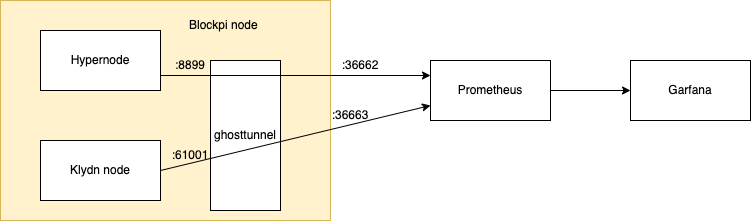

# Production level monitoring



This production grade system architecture use [ghostunnel](https://github.com/ghostunnel/ghostunnel) to increase security level. 

# Configure ghostunnel


## Set systemd

After you install ghostunnel on your machine, you can run that as a systemd. This will bind the original port to ghostunnel port.

Then you will modify the service file as the fowlling for Hyper node :

`gt-node-exporter.service`:
```
[Unit]
Description=Ghost Tunnel - HyperNode Exporter
After=network-online.target

[Service]
User=root
Restart=on-failure
ExecStart=/usr/local/ghostunnel/ghostunnel server --listen 0.0.0.0:36662 --target localhost:8899 --key /etc/ssl/private/ghostunnel-selfsigned.key --cert /etc/ssl/certs/ghostunnel-selfsigned.pem --disable-authentication

[Install]
WantedBy=multi-user.target
and the Klaytn node service file as the following:
```
For Klaytn port binding, `gt-node-exporter.service`
```
[Unit]
Description=Ghost Tunnel - Klaytn Node Exporter
After=network-online.target

[Service]
User=root
Restart=on-failure
ExecStart=/usr/local/ghostunnel/ghostunnel server --listen 0.0.0.0:36663 --target localhost:31275 --key /etc/ssl/private/ghostunnel-selfsigned.key --cert /etc/ssl/certs/ghostunnel-selfsigned.pem --disable-authentication

[Install]
WantedBy=multi-user.target
```

## Set ufw

So now ,if you enable and start the service, you will port forwarding 8899 to 36662 and expose it publicly to your  prometheus server. mind to allow it on ufw using this cmd:

```
sudo ufw allow proto tcp from <NODE IP> to <Prometheus IP> port 36662 comment "Hypernode monitoring"
```

```
sudo ufw allow proto tcp from <NODE IP> to <Prometheus IP> port 36663 comment "Klaytn node monitoring" 
```

# Prometheus monitoring

Follow the [official tutorial](https://testnet-docs.blockpi.io/guide-for-operators/testnet-1/monitoring). Prometheus should listen to the ghosttunnel output instead of the original output:

:8899 -> :36662

:61001 -> :36663 


